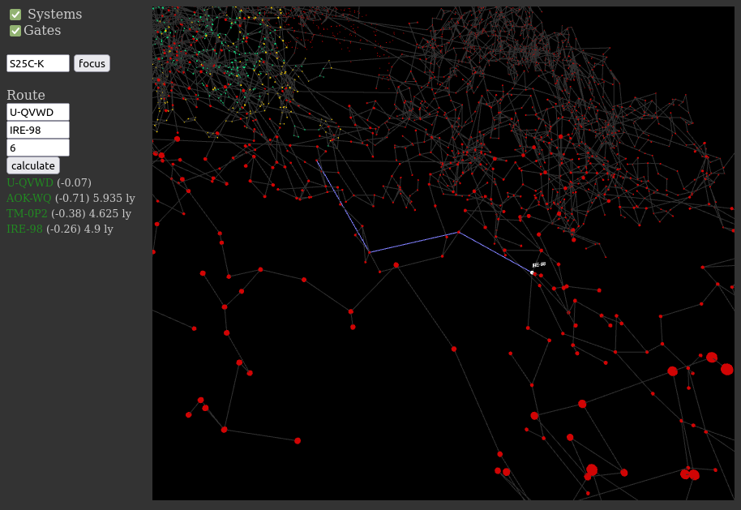

# EVE Map

A simple jump route calculator with a 3D map for EVE Online.



## Install

```
npm install

# or with Docker:
docker run -v $PWD:/app node:12-slim /bin/sh -c "cd /app; npm install"
```

Generate data files (in dist/data):
```
node src/js/cli/build-map.js
node src/js/cli/build-graph.js

# or with Docker:
docker run -v $PWD:/app node:12-slim /bin/sh -c "cd /app; node src/js/cli/build-map.js"
docker run -v $PWD:/app node:12-slim /bin/sh -c "cd /app; node src/js/cli/build-graph.js"
```

## Run dev server

```
npm start

# or with Docker:
docker run -it -v $PWD:/app -p 127.0.0.1:8080:8080 node:12-slim /bin/sh
cd /app
npm start
```

## Build distribution

```
npm run build

# or with Docker:
docker run -v $PWD:/app node:12-slim /bin/sh -c "cd /app; npm run build"
```

## Console

Route calculation, example:

```
node src/js/cli/route.js U-QVWD IRE-98 6

# or with Docker:
docker run -v $PWD:/app node:12-slim /bin/sh -c "cd /app; node src/js/cli/route.js U-QVWD IRE-98 6"
```

## Browser

`Route.js` can also be used directly in a web browser, it only needs the
data from `graph.json` (see above).

Example:

```javascript
// init
fetch('/data/graph.json').then(function(response) {
    response.json().then(function(json) {
        Route.graph = json;
    });
});
```
```javascript
// later in the code
const route = Route.calculateRoute(
    Route.findSystem('Amarr'), 
    Route.findSystem('GE-8JV'), 
    10
);
console.log(route);
```
